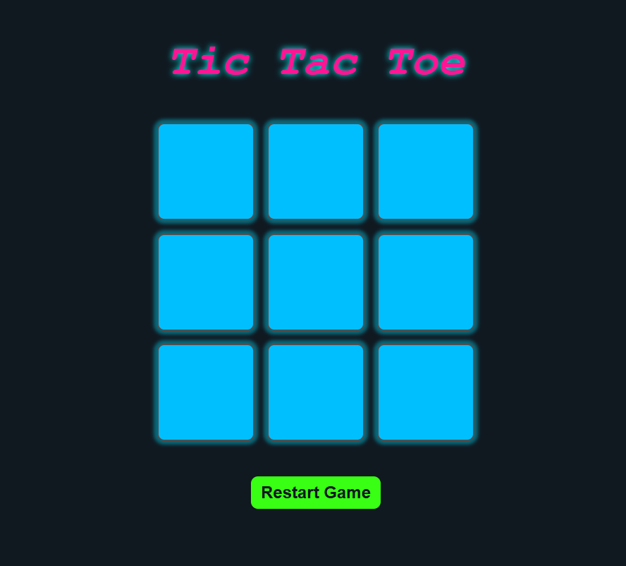

# Tic-Tac-Toe
A simple and interactive Tic Tac Toe game built using HTML, CSS, and JavaScript. It features a sleek dark theme, winner notifications,.

## Features  
- Modern dark theme with glowing effects  
- Two-player mode  
- Winner notification system  
- Restart and new game functionality
- Responsive design for all devices  

## Screenshots  
  
_A screenshot of the Tic Tac Toe game in action._

## How to Play  
1. Open the game and take turns placing X's and O's on the grid.  
2. The first player to get three in a row wins!  
3. Use the **Restart Game** button to reset the board. 
